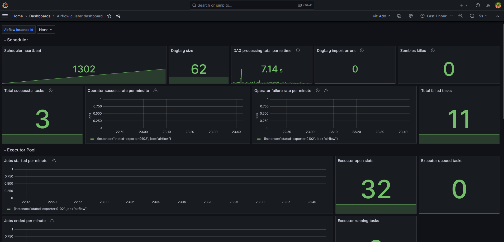

<<<<<<< HEAD
# Dibimbing Final Project

# Data Source 
 link kaggle : https://www.kaggle.com/datasets/rabieelkharoua/predict-pet-adoption-status-dataset?resource=download&select=pet_adoption_data.csv

# Project Background's 
- For Today’s digital age, monitoring and analyzing data are crucial for understanding trends and making informed decisions. This project focuses on monitoring pet adoption data using Grafana, a powerful tool for visualizing and analyzing metrics. By leveraging Grafana's capabilities, we can track various metrics related to pet adoption, such as adoption rates, time spent in shelters, adoption fees, and more.

# Objectives
Real-time Monitoring: Utilize Grafana to monitor real-time updates on pet adoption metrics.
Visualization: Create interactive dashboards to visualize adoption trends, including geographical distribution, age preferences, and adoption likelihood.
Data Analysis: Perform in-depth analysis to identify patterns and correlations within the adoption data.
Performance Tracking: Monitor shelter efficiency metrics like average time pets spend in shelters before adoption.

# Transformation & Consideration
- 
- Transformation 
` def transform_data(**kwargs):
    raw_data = kwargs['ti'].xcom_pull(key='raw_data', task_ids='extract_csv')
    df = pd.DataFrame.from_dict(raw_data)
    df['AgeCategory'] = df['AgeMonths'].apply(lambda x: 'kitten/puppy' if x < 12 else 'young' if x < 36 else 'adult' if x < 84 else 'senior')
    kwargs['ti'].xcom_push(key='transformed_data', value=df.to_dict())`
- On mysql 
 | 

# To run this repo must have docker, dbeaver
1. clone this repo
2. after clone cd project_airflow for the running project er airflow
    2.1 Run docker compose up -d, to up container `airflow`
3. Open terminal then run docker-mysql 
    3.1 cd docker-mysql, lalu jalankan docker compose up -d
4. Open another terminal to run docker-graphana, to monitor the live time of the DAGS that has been created

Here's the progress that has been made 

# Conclusion & Recommendation
- Conclusion: By implementing Grafana for monitoring pet adoption data, this project aims to provide shelters, animal welfare organizations, and policymakers with actionable insights to improve adoption processes, optimize resource allocation, and ultimately enhance the welfare of animals in need.
Future Directions: 
- Future enhancements could include predictive analytics for adoption trends, integrating additional data sources for enriched analysis, and expanding dashboard functionalities to include public engagement metrics.

# please contact me to enhancement this repo 

<<<<<<< HEAD
thanks
=======
thanks
>>>>>>> d57c1d2de683ed04eb557c2bc99f4a5e5d2d8a9e
